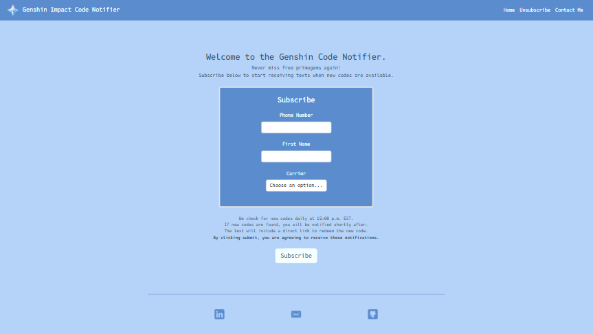
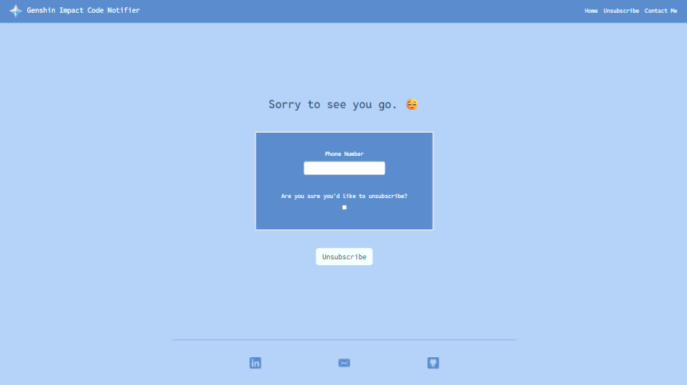
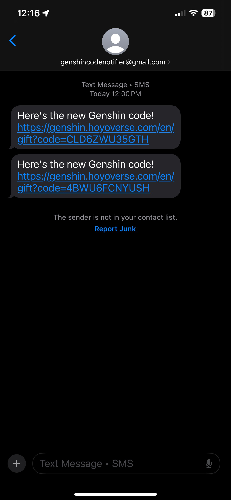
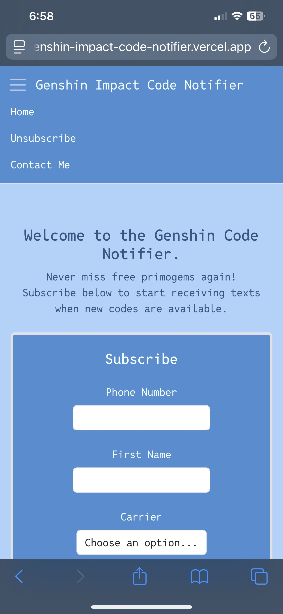
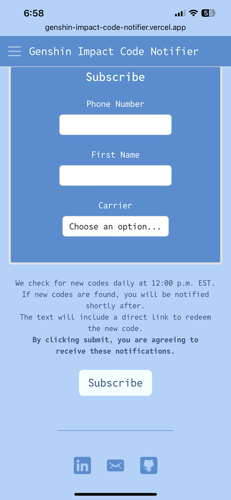

# Genshin Impact Code Notifier  

  
  
   
  
  
  

  
 

A full-stack web app that performs a daily automated scrape for new Genshin Impact redemption codes and notifies subscribed users via free text messages.

---

## Live Website  
 [Genshin Impact Code Notifier on Vercel](https://genshin-impact-code-notifier.vercel.app)  

---

##  Key Features  
- Automated daily scrape at 12 PM EST for new Genshin Impact codes  
- Free text message notifications for signed-up users 
- Users can unsubscribe via the website at any time
- PostgreSQL database hosted on [Neon](https://neon.com) for storing codes and user records  
- Selenium-powered scraping for automated data collection  
- Bootstrap frontend for a responsive and user-friendly interface  
- Hosted on [Vercel](https://vercel.com/) with a Django backend  

---

## Tech Stack  
  
  
  
  
  
  

---

## How It Works  
1. Every day at **12 PM EST**, a locally scheduled task uses Selenium to scrape [Brutefact's Redeem Codes and Web Events page on HoYoLAB](https://www.hoyolab.com/creatorCollection/535336) for new redemption codes.  
2. Extracted codes are parsed and validated against the PostgreSQL database hosted through Neon.
3. If new codes are found, they are added to the database.  
4. Users who signed up via the website receive free text alerts right after the daily check.  

---

## About This Project
This project was created to practice **automation using Python, full-stack web development, and cloud deployment**. It demonstrates:  
- Scheduling automated scraping workflows with Selenium  
- Managing a user sign-up system through a Django web app 
- Sending daily code notifications with Python scripts  
- Storing user and code data in a PostgreSQL database hosted via Neon
- Deploying a production-ready web app on Vercel  

---

## Reporting Issues
If you find bugs or have suggestions, please open an issue here:

**[Genshin Code Notifier Issues](https://github.com/baileystarr4/Genshin-Impact-Code-Notifier/issues)**

---

## License  
This project is licensed under the [MIT License](LICENSE).  
